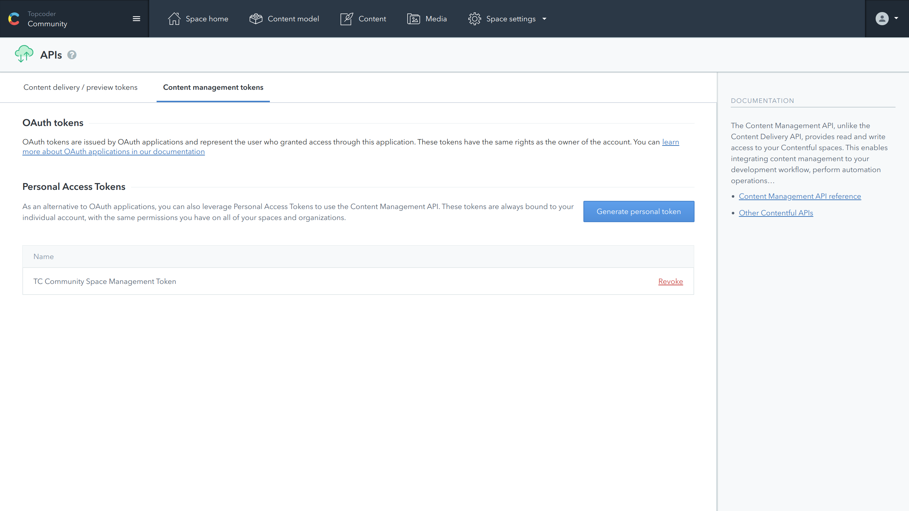
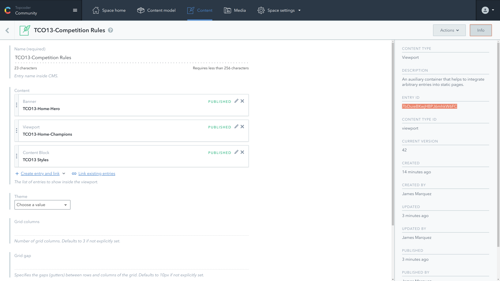
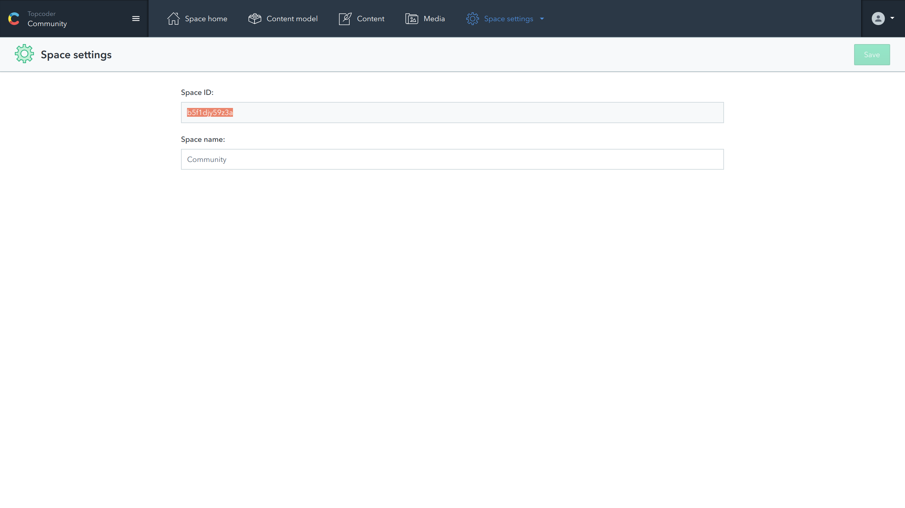

# Contentful duplicate - Help Guide
The contentful-duplicate cli tool allows users to recursively duplicate entries in Contenful from source space/environment to target space/environment. The entries are traversed doen the lined tree and new entries with same fields/values are created. 

This document describes how to use the tool. Follow the steps described below to setup your environment for work with the tool.

### 1. Generate content management token
This tool requires `cma_token`(Content Management API Token) to work. It provides read and write access to your Contentful space. Contentful spaces under same account do share one `cma_token` for all of them but if you use the tool to duplicate content between Contentful acounts you will need `cma_token` for each of them.

To generate `cma_token` go to `Space settings -> API keys`. Then open the `Content management tokens` tab and click on "Generate personal token". Follow the steps to generate it. **Note: Write the token to a file. It won't be shown to you anymore!**


### 2. Example usage
2.1. First we need to mark the `ENTRY ID` of entry or IDs of entities we want to recursively duplicate. Under the info tab/sidebar Contentful will display this info.


2.2. The space ID is available under `Space settings -> General settings`


when having above information open a terminal and invoke the tool command (if command is not available to you, probably you need to run `npm link` in the root repo folder).

**Basic example - duplicate single entry**
This will duplicate the entry and all its children recursively. It also add prefix and suffix to the name field of the entries replacing `HOME` with `CONTACT`.
```bash
contentful-duplicate \
--space-id '<source-space-id-here>' \
--mToken '<your-cma_token-here>' \
--entries '<entry-id-here>' \
--prefix '[COPY] - ' \
--suffix '[cloned]' \
--regex-pattern 'HOME' \
--replace-str 'CONTACT' \
```

**Duplicate multiple entries skipping some of them**
This will duplicate the entries but exclude some children. Means new entries will have linked children that are same as sorce **not** new copies of them.
```bash
contentful-duplicate \
--space-id '<source-space-id-here>' \
--mToken '<your-cma_token-here>' \
--entries '<entry-id1,entry-id2,entry-id3>' \
--exclude '<exclude-entry-id1,exclude-entry-id2,exclude-entry-id3>' \
```